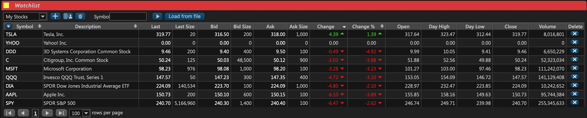
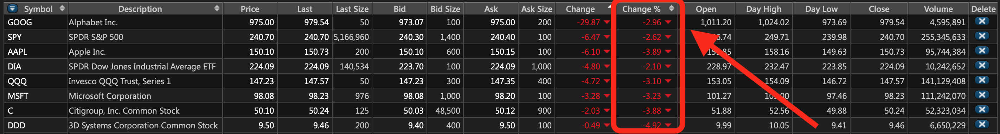
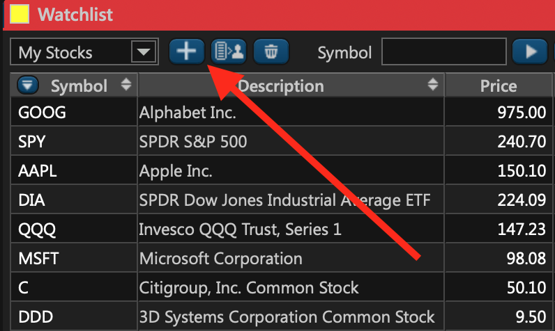
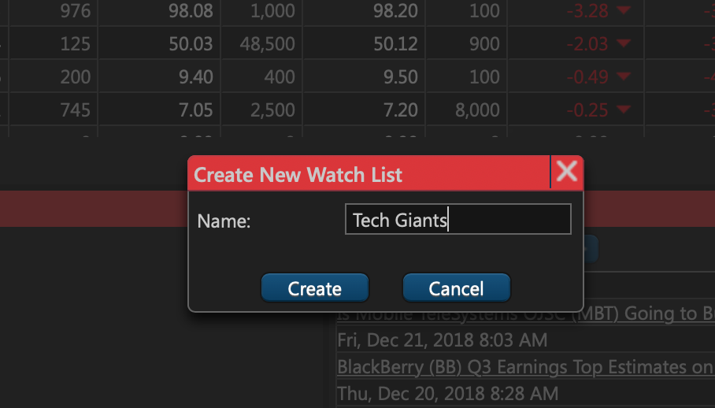
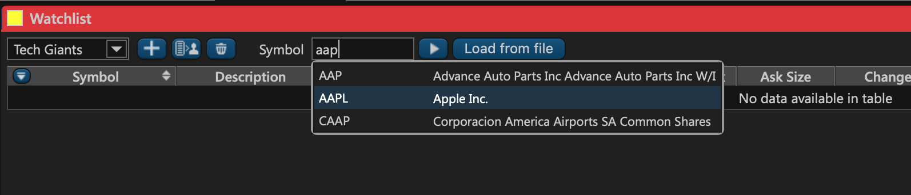
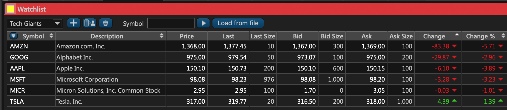
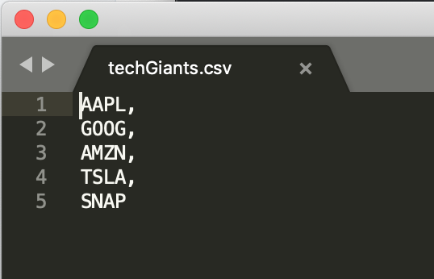
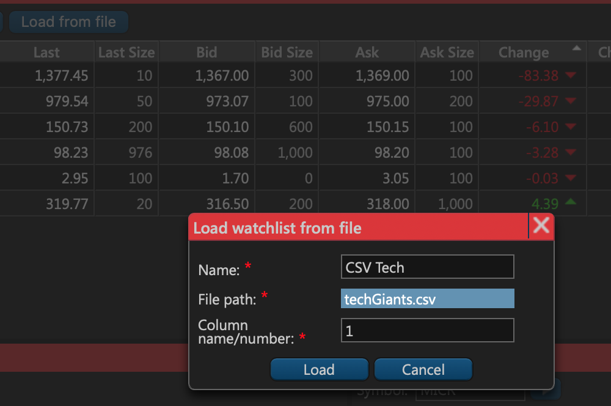
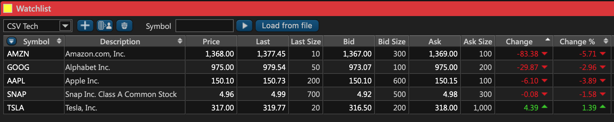

# Tab 3: Market Watch

### Introduction

The third tab of the ETNA Trader web app is called **Market Watch** and its main purpose is to display the securities in your watchlist. As a trader, you always track certain securities to keep up-to-date with their trading volume and their market price fluctuations. And this is exactly what you'll find in the first widget of this tab — **Watchlist**. This article demonstrates how you can use this widget to create watchlists, add new securities to the existing watchlists, and also how you can monitor the trading information associated with each of these securities. 

### Watchlist

The watchlist widget represents a table that contains a particular watchlist. You can create multiples watchlists if you need to split your securities into groups \(for example, by industry\). Each watchlist contains various trading information associated with a particular security, including:

1. **Symbol**. This is the ticker symbol under which the security is traded on the stock exchange. 
2. **Description**. This is usually the name of the underlying company or ETF.
3. **Last.** This is the price at which the last trade was executed before the closing time.
4. **Last Size**. This is the trade volume of the last executed trade.
5. **Bid**. This is the highest current price that traders are willing to pay for the security.
6. **Bid size**. This is the trade volume of the current bid price.
7. **Ask**. This is the lowest current price at which traders are willing to sell the security.
8. **Ask Size**. This is the volume of the current ask price.
9. **Change**. The difference between the security's closing price from the previous day and the current market price \(on the absolute basis\).
10. **Change %**. The difference between the security's closing price from the previous day and the current market price \(in percentage terms\).
11. **Open**. This is the price at which the first trade of the day was executed.
12. **Day High**. This is the highest price at which the security was traded during the day. 
13. **Day Low**. This is the lowest price at which the security was traded during the day.  
14. **Close**. This is the price at which the last trade of the day was executed.
15. **Volume**. This is the total number of shares that were traded during the day.

You can sort the table depending on the importance of a particular column. For example, if you want to sort the watchlist by the percentage price change, click **Change %**. As a result, the securities with the highest price appreciation \(or depreciation\) for the day will be listed first:

### Creating a New Watchlist

To create a new watchlist, simply click on the plus button next to the watchlist name.

Enter the name of the new watchlist and then click **Create**.

Thec watchlist has been successfully created. Now proceed to add securities to the newly created watchlist.

### Adding Securities to Watchlists

Once you've created a new watchlist, go ahead and add securities to it. In this example we've created a sample watchlist called _Tech Giants_. Clearly, this watchlist will track Silicon Valley behemoths, so let's proceed to add **Apple** as the first security in the watchlist. Locate the **Symbol** text field and start entering the company's name or stock exchange ticker symbol. Auto-suggest will automatically pop up, letting you select the required company. Click on **Apple Inc.** \(or whichever company you're adding\), and it'll automatically be added to your watchlist.

Continue adding securities to the watchlist until it is ready.

Alternatively, you can add securities to a new watchlist by importing them from a file. Suppose you have a CSV file with a single column that contains the ticker symbols of the required compamies. You can use this file to instantly create a new watchlist with the specified companies.

In the **Watchlist** widget, simply click **Load from file**. Enter the name of the new watchlist, specify the file's path, and indicate the required column in the file \(the first one in our case\). Click **Load**.

All of the companies in the file have been successfully added to the new watchlist. 

### Demo

If you'd like to see how creating new watchlists and adding new securities is performed in real time, feel free to watch our video that demonstrates the process:

